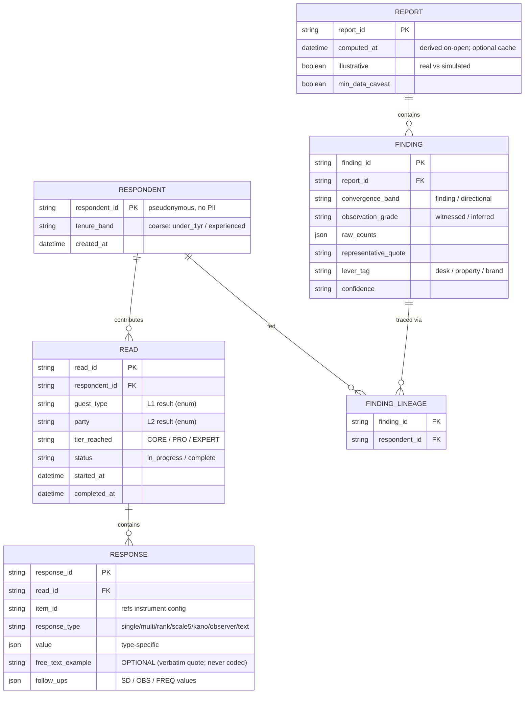

# GuestIQ — Data Model & API (v1.2)

| | |
|---|---|
| **Document** | GuestIQ-Data-Model-and-API — v1.2 (DRAFT · Stage 1a reconciliation · for Lead Researcher review) |
| **Project** | GuestIQ — Hotel Guest Expectations Research Application |
| **Supersedes & consolidates** | entity_relationship_diagram v1.0 · api_specification v1.0 · questionnaire_js_data_structure v1.0 |
| **Changes in v1.2** | Recorded **badge claim-and-lock**: fixed pool, `respondent_id` = claimed badge, claiming removes it from the **claimable** pool (badge stays tappable for **re-entry** — recognition, not authentication); added `/badges/available`, `/badges/claimed`, `/badges/claim`; uniqueness best-effort, **fragmentation + merge both fail conservative** (backs SRS FR-AGT-01/02). |
| **Implements (canon)** | Questionnaire v4.2 · Output-Spec v0.2 · Front-Desk Value Model v0.5 |
| **References** | SRS v3.1 (closes its NFR-PRIV-01 / §10.2 `respondent_id` dependency) |
| **Patched (Stage 1 sweep)** | Reconciled to **Questionnaire v4.2** + **GoldMap v0.4** + **no-AI / compute-on-open**: option config carries a **gold_tag** (BS/CON/MW/CF-sink) + **cf_sink** flag; **observer example now optional**; **L1 = 9** (added airline crew + executive/VIP) with **CREW/VIP batteries** + **CREW-4 segment-existence** field; **REPORT derived on-open** (deterministic, client-side), optionally cached — not server-generated. No AI/Edge-Function surface exists in this contract. |
| **Prepared By** | Claude (AI Developer) |
| **Date** | Sprint 4 planning — reconciliation Stage 1a |
| **Drift rule** | This document is the **data contract**: it defines the *shape* that holds canon content. It does not re-enumerate items — the instrument config (§4) references Questionnaire **v4.2** for content (option lists, gold tags). |

---

## 1 · Purpose & scope

Defines (a) the **persisted data model**, (b) the **instrument config structure** that represents Questionnaire v4.2 as data, and (c) the **API operations** the app and report engine use. It is the technical contract every build story is written against, and the home of the pseudonymity, distinct-respondent, lineage, and anonymity requirements stated in the SRS.

## 2 · Design principles (the load-bearing constraints)

- **Pseudonymity (NFR-PRIV-01).** `respondent_id` is a stable, generated token carrying **no PII** — no name, email, or device identifier stored. Any mapping from token to a real person (for pilot follow-up) is held **offline by the Lead Researcher**, never in the dataset.
- **Badge claim-and-lock.** Badges are a **fixed pool**; the `respondent_id` *is* the claimed badge token. Claiming a badge **removes it from the *claimable* pool server-side** (so no new agent can claim it) but it **stays tappable for re-entry** — a returning agent taps their claimed badge to continue. **Re-entry is recognition, not authentication**: on a shared PC the system cannot stop someone tapping a badge that isn't theirs. Uniqueness is **best-effort** — **fragmentation** (one agent across two badges) inflates the distinct count; **merge** (impersonation) deflates it; **both fail conservative** (make the floor harder to clear, never fabricate convergence). A researcher anomaly check flags likely fragments at analysis.
- **Distinct-respondent counting.** All aggregation counts distinct `respondent_id`, never reads or sessions (SRS FR-RPT-01).
- **One read per respondent per persona.** Enforced by a unique constraint (SRS FR-INST-13); "replay" means a *new* guest type.
- **Lineage retained.** Findings trace to the distinct respondents whose reads fed them, for the finding-loop and auditability (SRS FR-RPT-08, FR-AGT-08).
- **Anonymity by construction.** No API surface returns an individual's answers attributed by name; only the engine/researcher reads individual rows, and only aggregate patterns are exposed to GM- or agent-facing surfaces (SRS NFR-PRIV-02/03/04).
- **Service-layer only.** No direct client→Supabase calls from components (SRS NFR-SEC-01).

## 3 · Persisted data model

### 3.1 · Entity-relationship diagram

### 3.2 · Entities

- **RESPONDENT** — one row per agent. `tenure_band` is **coarse** (kept low-resolution to avoid de-anonymizing on a small desk) and drives TENURE gating + OBS weighting. No PII.
- **READ** — one row per (respondent, guest type). `status` supports save-and-resume (SRS FR-INST-14). Unique constraint on (`respondent_id`, `guest_type`).
- **RESPONSE** — one row per answered item. `value` is type-specific JSON; `free_text_example` is **optional** even for `observer` (collected as a verbatim quote, never coded — v4.2); the selected option keys in `value` resolve to their **gold tags** via the instrument config (§4), which the engine reads for Gate 4. `follow_ups` holds SD/OBS/FREQ values used by the engine's observation grading (SRS FR-RPT-03).
- **REPORT / FINDING** — the report engine's output (Output-Spec v0.2). **Derived on-open** (deterministic, client-side — Architecture v1.1); a REPORT row is an **optional cache**, not a required server artifact. `lever_tag` and `confidence` per the report skeleton.
- **FINDING_LINEAGE** — many-to-many: which distinct respondents fed each finding (FR-RPT-08). Powers the agent finding-loop.
- **COVERAGE** — *derived, not stored.* A query: per `guest_type`, count of distinct `respondent_id` with `status = complete` → mapped to a status band for the coverage map (FR-AGT-03). Counts are never exposed to agent surfaces — only the band (SRS FR-AGT-03).

### 3.3 · Key constraints

- Unique (`respondent_id`, `guest_type`) on READ.
- All convergence/coverage aggregation: `COUNT(DISTINCT respondent_id)`.
- FINDING_LINEAGE written at **report computation (compute-on-open)**, from the reads that fed each finding.
- No foreign key or column anywhere links `respondent_id` to a real identity.

## 4 · Instrument config structure (v4.2 as data)

The instrument is represented as **config**, not hard-coded, so v4.2 content is data-driven. Shape (content per Questionnaire v4.2 — not restated here):

- **tiers** — CORE / PRO / EXPERT, each listing its item blocks.
- **routing** — `L1` (guest purpose → segment battery; **9 values**: business · early-flight · holiday · cruise · event · medical · **airline crew** · **executive/VIP** · other) and `L2` (party → family/group add-on) tables (SRS FR-INST-04/05). The **CREW** and **VIP** batteries (CREW-1…4, VIP-1…4) are new; **CREW-4** carries a `segment_exists` flag that **gates crew findings** (GoldMap §14).
- **items** — `item_id`, `tier`, `block` (core / pro / expert / battery / family / group / property), `segment` (which L1 battery), `prompt_ref` (→ **v4.2**), `response_type`, `options[]`, `follow_up_tags[]` (SD/OBS/FREQ), auto-appended "Other" + "None / not this guest" (SRS FR-INST-07/08/09/10).
- **options[]** — each option is `{ key, label, gold_tag, cf_sink }` where **`gold_tag` ∈ {BS, CON, MW, CF}** (GoldMap v0.4) and **`cf_sink: true`** marks the "the usual…" table-stakes option that is **collected but suppressed from findings** (Output-Spec v0.2 gate 4). The engine reads these tags directly — Gate 4 is a lookup, not interpretation. `observer` items take an **optional** example (no longer required).

A configuration validator shall reject malformed config on load (incl. a missing `gold_tag` on any reportable option, or more than one `cf_sink` per question) before any respondent-facing content renders.

## 5 · API operations

All via the service layer. Grouped by purpose:

**Capture**
- `GET /badges/available` — **unclaimed** badges, for first-time claiming.
- `GET /badges/claimed` — **claimed** badges, for the recognition / **re-entry** display (a returning agent taps theirs; SRS FR-AGT-02).
- `POST /badges/claim` — claim an **unclaimed** badge as the `respondent_id`; **rejects an already-claimed badge** (claim-and-lock, SRS FR-AGT-01). Re-entry (tapping a claimed badge) sets the session identity **without a new claim**.
- `POST /reads` — start a read (respondent_id, guest_type, party, tier).
- `PATCH /reads/{id}` — save progress / resume (SRS FR-INST-14).
- `POST /reads/{id}/responses` — submit item responses (with follow-ups, free-text).
- `POST /reads/{id}/complete` — mark complete.

**Instrument**
- `GET /instrument/config` — return items/routing for a chosen L1/L2/tier (from §4 config).

**Aggregation & report**
- `POST /reports/generate` — run the Output-Spec 5-gate pipeline; write REPORT + FINDING + FINDING_LINEAGE.
- `GET /reports/{id}` — retrieve the report.
- `GET /reports/{id}/export` — CSV / PDF (SRS FR-RPT-09); failure → error + retry + Sentry capture.

**Agent value layer**
- `GET /coverage` — team bands + the caller's personal "expertise on record" portfolio (SRS FR-AGT-03/04). Returns bands and the caller's own breadth only — never another respondent's counts.
- `GET /reads/{id}/reveal` — the post-completion convergence reveal, confidence scaled to the floor, counts not names (SRS FR-AGT-05/06).
- `GET /respondents/{id}/findings` — which findings the respondent's reads fed, for the finding-loop (SRS FR-AGT-08).

## 6 · Privacy & access control

- **Individual responses** are readable only by the report engine and the Lead Researcher — never returned to GM- or agent-facing endpoints.
- **Agent-facing endpoints** (`/coverage`, `/reveal`, `/findings`) return only aggregates, bands, and the caller's own data — enforcing NFR-PRIV-02/03/04.
- **Small-N guard:** `/coverage` and `/reveal` suppress any breakdown that could identify an individual below the safe threshold (SRS NFR-PRIV-04).
- **Observability** (PostHog/Sentry) carries no PII; IP anonymization on (SRS NFR-OBS-01).

## 7 · Traceability & supersession

- **Supersedes** `entity_relationship_diagram`, `api_specification`, `questionnaire_js_data_structure`; their live content is carried here (Reconciliation Impact Map §9.6).
- **Closes SRS v3.0 NFR-PRIV-01** (pseudonymous `respondent_id` defined here) and the §10.2 data-model dependency.

## 8 · Resolved decisions (Lead Researcher, this session)

1. **`respondent_id`** — a **pre-provisioned per-person pseudonymous code**, entered at first run, persisted in local storage for one-tap return on a shared PC; the code is the canonical identity. **No offline token↔person key is kept** → the dataset is **fully anonymous** (maximal-anonymity fork), the cleanest IRB-exemption posture and the strongest agent anonymity promise. Targeted follow-up is handled by general team reminders, not by re-identification.
2. **Small-N suppression** — reuse the convergence floor of **3**: comparative/breakdown detail is suppressed below 3 distinct respondents (the reveal shows only first-on-record at 1, forming at 2). Coverage bands: *Not yet heard* = 0 · *Thin* = 1–2 · *Getting there* = 3–4 · *Well covered* = 5+.
3. **`tenure_band`** — exactly **two bands** (`under_1yr` / `experienced`), used **internally only** (TENURE gating + OBS weighting); never surfaced and never a breakdown dimension.
4. **Supabase specifics** — deferred to **System Architecture & Flows (Stage 1b)** with three locked requirements: RLS enforces §6 access control; migration = **fresh schema, old-model data archived not migrated**; index for `COUNT(DISTINCT respondent_id)`.

---

*GuestIQ · Data Model & API · v1.2 · DRAFT · Stage 1a · The data contract; shape holds canon content*
