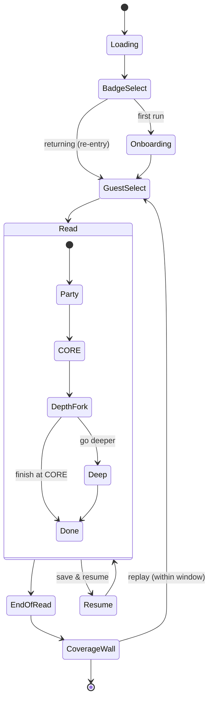

# GuestIQ — System Architecture & Flows (v1.1)

| | |
|---|---|
| **Document** | GuestIQ-System-Architecture-and-Flows — v1.1 (DRAFT · Stage 1 reconciliation) |
| **Project** | GuestIQ — Hotel Guest Expectations Research Application |
| **Supersedes** | v1.0 (which proposed Supabase Edge Functions for the Claude API) |
| **Implements** | SRS v3.1 · Data Model & API v1.2 · Observability v2.0 · Questionnaire **v4.2** · GM Priors & Gold Map **v0.4** · the value models & lock docs |
| **Changes in v1.1** | **Reverses v1.0 §1.** The "no third-party AI" decision removed the only driver for server-side compute (the Claude API key). Architecture returns to **pure client + Supabase DB — no Edge Functions.** Report engine is a **client-side deterministic module**; the agent story uses **RosaeNLG (local, in-browser)**; report "generation" is **compute-on-open**. The Anthropic dependency, the IRB-processor question, and the Option A/B free-text fork are all **gone**. |
| **Prepared By** | Claude (AI Developer) |
| **Drift rule** | References FR/NFR IDs and the data/observability/instrument docs; does not restate them. |

---

## 1 · The architecture is pure client + Supabase DB (no server-side compute)

v1.0 introduced Edge Functions **only** to keep a Claude API key off the public client. Two later decisions removed that need entirely:
- **Agent story → RosaeNLG** (a local, rule-based NLG library that runs in the browser — no API, no key).
- **Free-text → structured capture (Questionnaire v4.2)** + **deterministic report engine** — no AI coding, no key.

> **Decision (ratified): no Edge Functions.** Everything runs **client-side (React PWA) against Supabase (Postgres + RLS).** There is **no server-side code and no third-party AI.** The only reason Edge Functions existed has been designed away.

**"Generation" = compute-on-open.** With no scheduler needed, the report engine runs **client-side when the report or Console is opened** — it pulls the reads, runs the deterministic 5-gate pipeline, and renders. To the GM this is identical to "the system generated it" (it appears, ready, in <1s at pilot scale) and still requires **no researcher trigger** (FR-RPT-10, reframed: *computed automatically on access, no researcher step*).

## 2 · Architecture overview

| Layer | Role |
|---|---|
| **L1 · Frontend** | React 18 + Vite **PWA**, static files on GitHub Pages. All UI **and** all compute: capture, the **deterministic report engine**, **RosaeNLG** story generation, the GM report viewer, the Researcher Console. Talks outward only through service files. |
| **L2 · Backend** | **Supabase** — PostgreSQL + RLS + Migrations. **Data only. No Edge Functions, no server-side logic.** |
| **L3 · Hosting / CI** | GitHub Pages + GitHub Actions. Unchanged. |
| **Observability** | Sentry + PostHog — plumbing unchanged; event taxonomy per Observability v2.0. |

**Three inviolable disciplines (retained):** (1) no component imports Supabase/PostHog directly — all via service files; (2) no hardcoded content strings; (3) no credential in any committed file. *(With no AI/API, there is now no third-party key to manage at all.)*

## 3 · Frontend (L1)

React 18 + Vite PWA; service-layer pattern (`supabase.js`, `analytics.js`). New **client-side modules** (not services — pure compute):
- **`reportEngine.js`** — the deterministic **5-gate pipeline** (aggregate by distinct respondent → convergence floor → observation grade → **gold-map filter using the v4.2 tags / GoldMap v0.4** → guardrails). Pure functions, no network beyond reading data.
- **`story.js`** — **RosaeNLG** templates that turn a read's answers into the end-of-read story, **bounded strictly to those answers** (FR-AGT-10). Runs in-browser; nothing transmitted.

Surfaces: agent (badge → onboarding → guest+grounding → read → end-of-read → wall → replay), GM (report viewer, PIN-gated, auto-lock), researcher (Console, PIN-gated, six lenses). Libraries: Tailwind, Framer Motion (end-of-read), Radix, Recharts (Console), **RosaeNLG** (new), i18next.

## 4 · Backend (L2 · Supabase)

PostgreSQL + RLS + Migrations only. Entities per Data Model v1.2 (RESPONDENT/badge, READ, RESPONSE, REPORT?, FINDING, FINDING_LINEAGE). **Note:** with compute-on-open, the REPORT can be **derived on demand** rather than stored — optionally cached. Badge claim-and-lock enforced server-side (DB constraint). **RLS** provides aggregate-only, property-scoped reads for the GM report and Console (PIN-gated at the app layer). **No Edge Functions.**

## 5 · Information architecture (screen map)
- **Agent:** `Badge (claim/re-enter)` → *(first run)* `Onboarding` → `Guest + grounding` → `Read: Party → CORE → [Depth fork → PRO/EXPERT]` → `End-of-read (5 beats)` → `Coverage wall` → (replay).
- **GM:** `Ctrl+Alt+A → PIN → Report` *(computed on open; auto-lock)*.
- **Researcher:** `in-app → Researcher PIN → Console` *(six lenses; report/integrity computed on open)*.
No dashboard, no `/admin`, no SHIFT+CTRL+A.

## 6 · Application state

PIN-gated overlays (`GMReport`, `ResearcherConsole`) sit outside the agent state machine; both compute on open, auto-lock, and require the PIN every open.

## 7 · Data flows (no third party)

- **Capture:** agent answer → `supabase.js` → Postgres (READ/RESPONSE); event → `analytics.js` → PostHog; error → Sentry. Offline-tolerant (queue + flush; NFR-REL-01).
- **Story:** end-of-read → `story.js` (**RosaeNLG, in-browser**) → story rendered from the read's own answers. **Nothing leaves the device.**
- **Report (compute-on-open):** GM/researcher opens → `reportEngine.js` reads the data → runs the **deterministic 5-gate pipeline** (gold-map filter uses v4.2 tags + GoldMap v0.4; **CF-sink picks suppressed**) → renders. No AI, no coding, no server.
- **Console:** reads Supabase aggregate (integrity, coverage) + PostHog/Sentry/open-log (the three lenses), behind the researcher PIN.

## 8 · Production readiness

- **Free-tier envelope:** GitHub Pages + Supabase + PostHog + Sentry — pilot well within limits. **No Anthropic usage, no GPU, no inference cost** — the privacy-cleanest and cheapest configuration.
- **Secrets:** Supabase keys only, in `.env`. **No AI key anywhere.**
- **No Edge Function deployment** — CI/CD is the static build + Supabase migrations, exactly as the original design.
- RosaeNLG ships in the client bundle (a JS library; verify bundle-size impact — minor).

## 9 · Privacy (the win)

- **No third-party processor at all.** The Anthropic-as-processor concern from v1.0 §9 is **resolved/removed** — record in the IRB-Path-Decision. The only external services are Supabase (data, no PII), PostHog, and Sentry (both IP-anonymized, no PII).
- The story (RosaeNLG) and the report (engine) are computed **in the browser** — answer content never goes to any AI service.
- Per-badge data stays in the Console; pseudonymous badge with no key; small-N protection; masked replay.

## 10 · What's removed / reversed
- **Removed (drift):** the 9-panel dashboard, `getDashboardData()`, dashboard RLS, SHIFT+CTRL+A, `/admin`.
- **Reversed from v1.0:** the **Edge Functions + Claude API** layer (`generate-story`, `generate-report`) — designed away by the no-AI + structured-capture decisions. RosaeNLG (client) replaces `generate-story`; the deterministic `reportEngine.js` (client) replaces `generate-report`.

## 11 · Open decisions
1. **Report caching** — derive-on-open every time vs cache the computed report in a REPORT row (perf at scale). Pilot: derive-on-open is fine.
2. **RosaeNLG bundle size** — confirm it's acceptable in the client bundle (fallback: hand-templates).

---

*GuestIQ · System Architecture & Flows v1.1 · DRAFT · Pure client + Supabase · No Edge Functions · No third-party AI · Compute-on-open · Story = RosaeNLG (local)*
